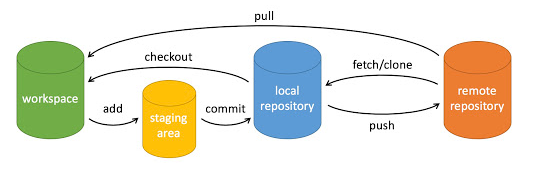
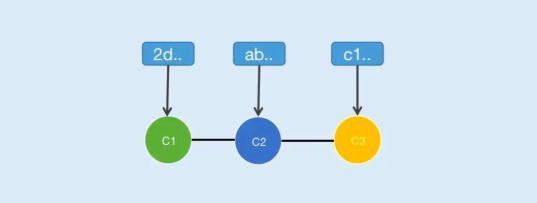

### Git
git是一个开源的分布式版本控制系统，与SVN类似但是Git是分布式的，利于分支来操作管理代码，Git的操作一般使用命令，SVN操作一般倾向于可视化页面

git下载地址：https://git-scm.com/downloads



说明：
workspace：工作区
staging area：暂存区/缓存区
local repository：版本库或本地仓库
remote repository：远程仓库

#### commit提交节点与分支


#### Git 基本操作
```
git clone <仓库地址>
拷贝一个 Git 仓库到本地

git merge <本地分支名>
将两个分支的内容进行合并，在被合并分支后创建一个合并后的新节点

git rebase <本地分支名>
将两个分支的内容进行合并，在被合并分支后加入合并分支的节点内容

git branch
用于查看本地仓库分支和远程仓库分支

git remote add [shortname] [url]
添加远程版本库

git fetch
用于从远程获取代码库。

git checkout <本地分支名>
切换本地分支

git pull <本地分支名>
用于从远程获取代码并合并本地的版本

git add .
添加当前目录下的所有文件到暂存区

git commit -m [message]
将暂存区内容添加到本地仓库中

git push <本地分支名>|<远程分支名>
用于从将本地的分支版本上传到远程并合并
```


#### 项目中使用git的场景
1. 需求开发前的分支拉取流程？
2. 需求开发后的分支合并流程？
3. 分支合并出现冲突如何解决？
4. 出现线上问题时hotfix分支的操作流程？
5. 线上出现事故代码如何回退？


