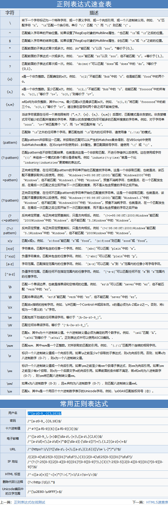

### 正则表达式的构成
正则表达式可以由简单的字符组成，也可以是简单字符和特殊字符组成。其中特殊字符我们称为元字符，如：^ $ + 等等
```js
/^[1-9]\d*$/
/^([1-9]\d*(\.\d{1,2})?|([0](\.([0][1-9]|[1-9]\d{0,1}))))$/
```

### 正则表达式中的特殊字符


#### 字符类
|字符   |说明  |
|--------|------|
|\d   |匹配任何数字(阿拉伯数字)，相当于[0-9]|
|\D   |匹配任何非数字(阿拉伯数字)的字符|
|\w   |匹配基本拉丁字母中的任何字母数字字符，包括下划线。相当于 [A-Za-z0-9_]|
|\W   |匹配任何不是来自基本拉丁字母的单词字符|
|\s   |匹配单个空白字符包括空格 制表符 回车符 换行符，相当于[\f\n\r\t\v\u00a0\u1680\u2000-\u200a\u2028\u2029\u202f\u205f\u3000\ufeff]|
|\b   |匹配一个词的边界|

#### 边界符
正则表达式中的边界符（位置符）用来**提示字符所处的位置**，主要有两个字符

|边界符   |说明  |
|--------|------|
|^   |表示匹配行首的文本（以谁开始）|
|$   |表示匹配行尾的文本（以谁结束）|

```js
// 创建正则的两种方式
// 1.字面量的方式创建
// 2.通过RegExp

var rg = /123/ // 字面量不用加引号
var rg = new RegExp(123)
```
```js
// /123/ 匹配内容是否包含有123
var rg = /123/
console.log(rg.test('123'))
console.log(rg.test('1234'))
console.log(rg.test('41234'))
console.log('-----------------------')
// 匹配包含123开头内容
var rg1 = /^123/
console.log(rg1.test('123'))
console.log(rg1.test('1234'))
console.log(rg1.test('41234'))
console.log('-----------------------')
// 精确匹配 要求内容必须是123
var rg2 = /^123$/
console.log(rg2.test('123'))
console.log(rg2.test('1234'))
console.log(rg2.test('41234'))
console.log(rg2.test('123123'))
```
^和$一起使用表示精确匹配

#### 字符集合
字符集合表示有一系列字符可供选择，只要匹配其中一个就可以。所有可供选择的字符都在方括号内
```js
// 不带边界符
var rg = /[abc]/
rg.test('a')
rg.test('ab')
rg.test('abc')
rg.test('abcd')
// 存在起止边界符
var rg1 = /^[abc]$/
// 其他场景
var rg2 = /[a-z]/ // -表示取某个范围值
var rg3 = /[^a-z]/ // ^表示取反
```

#### 量词符
量词符用来设定某个模式出现的次数
|量词符   |说明  |
|--------|------|
|*   |重复零次或更多次|
|+   |重复一次或更多次|
|?   |重复零次或一次|
|{n} |重复n次|
|{n, m}|重复n到m次|
```js
var rg = /^[a-z]0*$/
var rg1 = /^[a-z]0+$/
var rg2 = /^[a-z]0?$/
var rg3 = /^[a-z]0{2}$/
var rg4 = /^[a-z]0{1,2}$/
```

#### 分组符号
对字符进行分组，小括号包裹的内容可以看作一个整体
```js
var rg = /^abc{1,3}$/
var rg1 = /^(abc){1,3}$/
```

### 正则表达式的参数
思考一个问题
我们需要匹配到某个字符串中所有满足条件的字符，应该如何匹配？
#### 正则表达式参数
/表达式/[switch]
|表示   |说明  |
|--------|------|
|g   |全局搜索|
|i   |不区分大小写搜索|
|m   |多行搜索|
|s   |允许.匹配换行符|
|u   |使用unicode码的模式进行匹配|
|y   |执行“粘性(sticky)”搜索,匹配从目标字符串的当前位置开始|
```js
var rg = /ab/g
'ababab'.match(rg)
```


### 正则表达式常见的用法
#### replace替换
replace方法可以实现替换字符串操作
```js
// str.replace(regexp|substr, newSubStr|function)
// 第一个参数可以是正则或者字符串
// 第二个参数为需要替换的字符串或者一个函数

// 要求1：将手机号的中间四位替换成*，例如13877283312变成138****3312
// 要求2：单词首字母转为大写，例如my name is allen, i like code.
```