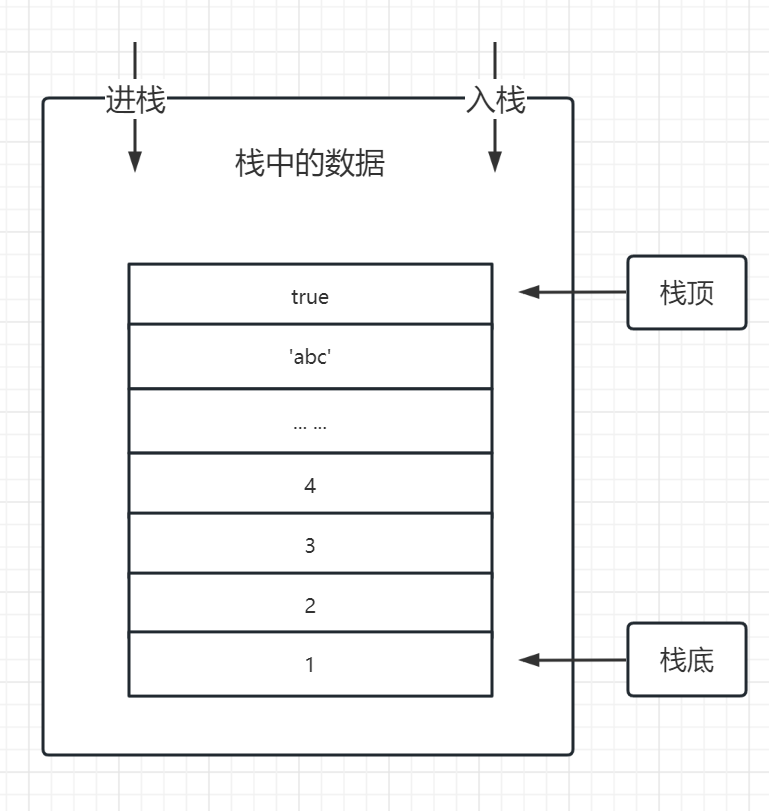
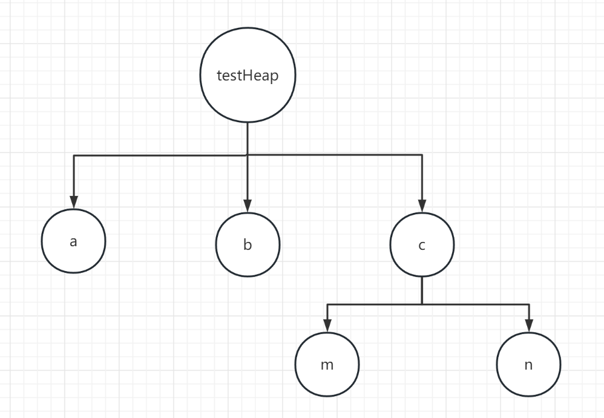

## 内存空间
#### 重要性
**想要对js理解更深刻，就需要对内存空间有个清晰的认知**

- 比如基本和引用数据类型存储方式和引用传递到底是怎么回事？ 
  
- 栈内存与堆内存的区别？


#### 计算机存储空间
- 内存：容量小 访问速度快 程序运行时（临时占用）
- 硬盘：容量大 访问速度慢 程序安装


#### js运行和存储空间的关联
- js运行在哪里？ 运行在内存
- 和硬盘完全没有关联吗？ 数据的持久化存储

##### js的哪些场景会占用内存空间？
- 函数声明 -> 函数体：页面运行期间持续存在
- 函数运行 -> 执行上下文：临时占用内存空间，函数运行结束释放内存

#### 内存的生命周期（内存管理的过程）
- 分配内存 (定义变量)
- 使用内存（变量值的读取或写入）
- 回收内存（对不在使用的数据进行回收）

```js
// 分配内存
var obj = {
  b: 2
}

var obj1 = 1

// 使用内存
console.log(obj)

// 回收内存
obj = null
```

#### js中内存空间类型：栈内存与堆内存
栈内存与堆内存本身没有区别，只是存储方式的差异，有了不同。

- 栈内存：通常用于记录函数执行记录（函数调用栈），包括函数内的基础数据类型
- 特性：先进后出 后进先出
- 使用场景：通常用于记录函数的执行记录，它代表了函数的执行顺序（函数调用栈）



- 堆内存：存储引用数据类型，也就是对象
- 特性：堆内存中的变量只有在所有对它的引用都结束的时候才会被回收。


```js
var testHeap = {
  a: 10,
  b: 20,
  c: {
    m: 100,
    n: 110
  }
}

testHeap.a
```


## 数据类型
#### 基础数据类型 => 栈内存
- string
- number 
- boolean
- null
- undefined
- BigInt
- Symbol

##### 特性：
- 按值访问
- 是不可变数据（值本身无法被改变）

实例说明：
```js
var a = 1;
var b = a;

console.log(a === b) 对于这种基本数据类型，赋值的话 是把值给了对象，比较的是值，所以相同。
b += 1;   //改为b=2 是不是说 b的值还是1 
console.log(a === b) 但是后来b+=1 有创建了一个新的变量 值为2 ； 但是a不会改变
console.log(a);
console.log(b); 

var str = 'hello'
str += 'world'
```
说明：
- 第一个打印中a b 的等价，并不表示他们是同一个地址（指向同一个内存地址）。a赋值给b的时候，其实是把1这个值赋值给了b，而不是赋值的内存地址。所以说，基础数据类型，是按值访问的。

**当两个基础类型的变量进行比较时，本质上，也是他们的值在进行比较**

```js
var a = 1;
var b = a;
console.log(a === b)  比较的是值，所以相同。
```

- 通过图例看下数据变化的过程


不可变数据实例2:
如：对字符串的操作一定是返回一个新字符串，原始字符串并没有被改变
```js
var str = 'hello world'
str[0] = 'b'

console.log(str)  所以输出的还是 hello world
```


#### 引用数据类型（对象） => 堆内存
- object
- array
- function
- Date
- RegExp
- ...


##### 特性：
- 按引用访问          这里就是复制了地址， 他们指向同一个地址。
- 值可以被改变
```js
var a = {
    m: 1
};
var b = a;
console.log(a === b)
b.m = 2
console.log(a === b)
console.log(b.m);
console.log(a.m);
```
通过图例看下数据变化的过程

##### 当引用数据类型在进行比较时，本质上，是对他们的内存地址进行比较  （内存地址存储在 堆中。
```js
var a = {}
var b = {}
console.log(a == b) 
```
###### 对象常见雷区：引用传递
```js
// 示例1
var person = {
  province: 'hubei',
  city: 'wuhan'
}

function getPerson(p, name, age) {
  p.name = name; 
  p.age = age;
  return p;
}

var a = getPerson(person, 'Bob', 10); 会改变person的值。

console.log(a);
console.log(person);
console.log(a === person);  比较的也是地址。

// 示例2
var foo = {
  a: 1,
  b: 2
};

var bar = Object.assign(foo, { c: 100 }); 只是一个前拷贝，

console.log(foo, bar);

var bar = Object.assign({}, foo, { c: 100 });
```