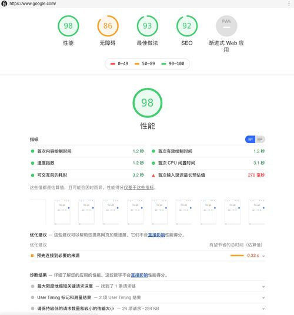
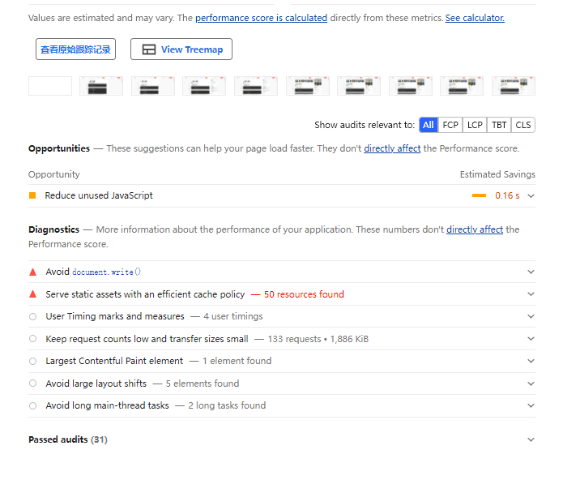

## 性能优化详解
### 什么是性能？
Web 性能是客观的衡量标准，是用户对加载时间和运行时的直观体验。Web 性能指页面加载到可交互和可响应所消耗的时间，以及页面在交互时的流畅度——滚动是否顺滑？按钮能否点击？弹窗能否快速打开，动画是否平滑？Web 性能既包括客观的度量如加载时间，每秒帧数和到页面可交互的时间；也包括用户的对页面内容加载时间的主观感觉。 

### 如何进行Web性能优化?
1. 首先需要了解性能指标 - 多块才算快？
2. 使用专业的工具可量化的评估出网站或应用的性能表现
3. 从网站页面响应的声明周期，分析出造成较差性能表现的原原因
4. 进行技术改造，可行性分析等具体的优化实施
5. 迭代优化

### web性能报告
Lighthouse分析web应用程序和web页面，收集关于开发人员最佳实践的现代性能指标和见解，让开发人员根据生成的评估页面，来进行网站优化和完善，提高用户体验。

#### Lighthouse的使用方式

1. 使用google浏览器自带工具Lighthouse
2. 在google应用商店下载扩展程序
Lighthouse会从5个维度给出打分：检测得分 性能指标 优化建议 诊断结果及已通过的性能

经过检测，Lighthouse会对上述5个维度给出0~100的评估得分，得分能到达90分以上，则说明网站应用在该方面的评估表现符合最佳实践，如下图所示：

整个评测结果会给出优化建议，将从下面几点说明
1. **移除阻塞渲染的资源**，部分javascript脚本文件和样式表文件可能会阻塞系统通对网站页面的首次渲染，建议可将其以内嵌的方式引用，并考虑延迟加载。报告中会将涉及需要优化的资料文件排列在下面，每个文件还包括尺寸大小信息和优化后预计提升首屏渲染时间的效果，据此可安排资源文件优化的优先级

2. **预连接所需要请求的源**，提前建立与所要访资源之间的网络连接，有两种方式。第一种是设置（link rel="preconnect"）的预连接，另一种是设置（link rel="dns-prefetch"）的DNS预解析。

3. **降低服务端的响应时间**

4. **适当调整图片大小**

除此之外，报告还给出诊断结果，同理以下几个维度来说明

1. **对静态资源文件使用高效的缓存策略** 比如对图片，css，js文件的缓存
2. **减少主线程的工作** 浏览器在渲染主进程时需要处理大量工作：比如解析HTML构建DOM，解析css样式表文件和执行javascript文件。所以渲染进程的主线程繁忙会导致用户响应延迟的不良体验，在Lighthouse中会提供主线程对各个任务的执行耗时，让开发者可以针对异常处理过程进行有目标的优化
3. **减少http请求数**

#### 浏览器缓存策略
- 强缓存
  - 不会向服务器发送请求，直接从缓存中读取资源，在chrome控制台的Network选项中可以看到该请求返回200的状态码，并且Size显示from disk cache或from memory cache。强缓存可以通过设置两种 HTTP Header 实现：Expires 和 Cache-Control。
  - Cache-Control
    - public 表示响应可以被客户端和代理服务器缓存
    - private 表示响应只可以被客户端缓存
    - max-age=30 缓存30秒后过期，需要重新请求
    - s-maxage=30 覆盖max-age，作用一样，只在代理服务器中生效
    - no-store 不缓存任何响应
    - no-cache 资源被缓存，但是立即失效，下次会发起请求验证资源是否过期
    - max-stale=30 30秒内，即使缓存过期，也使用该缓存
    - min-fresh=30 希望在30秒内获取最新的响应
  -  Expires
    - 缓存过期时间，用来指定资源到期的时间，是服务器端的具体的时间点。也就是说，Expires=max-age + 请求时间，需要和Last-modified结合使用。Expires是Web服务器响应消息头字段，在响应http请求时告诉浏览器在过期时间前浏览器可以直接从浏览器缓存取数据，而无需再次请求。
    **缺点**受限于本地时间，如果修改了本地时间，可能会造成缓存失效
- 强缓存的两个状态
  - from memory cache
   - 不访问服务器，一般已经加载过该资源且缓存在了内存当中，直接从内存中读取缓存。浏览器关闭后，数据将不存在（资源被释放掉了），再次打开相同的页面时，不会出现from memory cache。
  - from disk cache
    - 不访问服务器，已经在之前的某个时间加载过该资源，直接从硬盘中读取缓存，关闭浏览器后，数据依然存在，此资源不会随着该页面的关闭而释放掉下次打开仍然会是from disk cache。
- 协商缓存
  - 协商缓存就是强制缓存失效后，浏览器携带缓存标识向服务器发起请求，由服务器根据缓存标识决定是否使用缓存，主要有以下两种情况：
    - 协商缓存生效，返回304和Not Modified
    - 协商缓存失效，返回200和请求结果 
#### 精炼js代码
- 减少业务复杂度
- 算法上优化
  - 一般情况下，算法中基本操作重复执行的次数是问题规模n的某个函数，用T(n)表示，若有某个辅助函数f(n),使得当n趋近于无穷大时，T(n)/f(n)的极限值为不等于零的常数，则称f(n)是T(n)的同数量级函数。记作T(n)=Ｏ(f(n)),称Ｏ(f(n)) 为算法的渐进时间复杂度，简称时间复杂度。
- 动态规划
动态规划常常适用于有重叠子问题和最优子结构性质的问题，动态规划方法所耗时间往往远少于朴素解法。
动态规划背后的基本思想非常简单。大致上，若要解一个给定问题，我们需要解其不同部分（即子问题），再根据子问题的解以得出原问题的解。
- 适用情况
 - 最优子结构
    最优子结构性质。如果问题的最优解所包含的子问题的解也是最优的，我们就称该问题具有最优子结构性质（即满足最优化原理）。最优子结构性质为动态规划算法解决问题提供了重要线索。
 - 无后效性。
    即子问题的解一旦确定，就不再改变，不受在这之后、包含它的更大的问题的求解决策影响
 - 子问题重叠
     子问题重叠性质。子问题重叠性质是指在用递归算法自顶向下对问题进行求解时，每次产生的子问题并不总是新问题，有些子问题会被重复计算多次。动态规划算法正是利用了这种子问题的重叠性质，对每一个子问题只计算一次，然后将其计算结果保存在一个表格中，当再次需要计算已经计算过的子问题时，只是在表格中简单地查看一下结果，从而获得较高的效率。

### 一道面试题
从浏览器地址栏输入URL后，到页面渲染出来，整个过程都发生了什么？

1、首先浏览器在输入URL之后，会先解析URL，判断是否合法；
2、合法的话会查看浏览器缓存，判断是否有缓存，如果有缓存，则显示；
3、如果没有缓存，浏览器会向服务器发送HTTP协议，会进行DNS解析，获取IP地址；
4、浏览器和服务器进行TCP连接，进行三次握手；
5、握手成功之后，浏览器会向服务器发送http请求，请求数据包；
6、服务器处理请求，将数据返回给浏览器；
7、浏览器收到HTTP响应后，会解析它；
8、浏览器发送异步请求，然后渲染页面