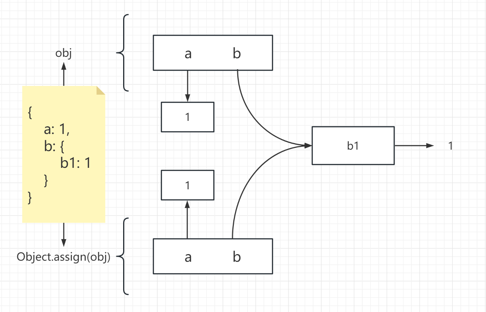

### 浅拷贝
#### 概念
浅拷贝是其**属性与拷贝源对象的属性共享相同引用**，当你更改源或副本时，也可能导致其他对象也发生更改

```js
// 这个种方式不是深拷贝
var people = {
    name: 'allen'
}

var people1 = people
people1.name = 'jason'

// 浅拷贝
var obj = {
    a: 1,
    b: {
        b1: 1
    }
}
var obj2 = Object.assign({}, obj)
```



#### 浅拷贝的方法
Object.create()
```js
var obj = {a: 1}
var obj2 = Object.create(obj)
obj.a = 2
```
Object.assign()
```js
var obj = {
    a: 1,
    b: {
        b1: 1
    }
}
var obj2 = Object.assign({}, obj)
obj.a = 2
obj.b.b1 = 2
```
扩展运算符
```js
var obj = {
    a: 1,
    b: {
        b1: 1
    }
}
var obj1 = {...obj}
obj1.a = 2
obj1.b.b1 = 2
```

### 深拷贝
#### 概念
深拷贝是**指其属性与其拷贝的源对象的属性不共享相同的引用**，当你更改源或副本时，可以确保不会导致其他对象也发生更改

#### 深拷贝的方法
JSON.parse(JSON.stringify())
```js
var obj = {
    a: 1,
    b: {
        b1: 1
    }
}
var obj1 = JSON.parse(JSON.stringify(obj))
obj1.a = 2
obj1.b.b1 = 2

// 注意：函数，Symbol，正则，undefined
var obj = {
    a: function () {},
    b: Symbol('obj'),
    c: /abc/,
    d: undefined
}

var obj1 = JSON.parse(JSON.stringify(obj))
```
Lodash.cloneDeep()
```js
// cdn地址
// https://cdnjs.cloudflare.com/ajax/libs/lodash.js/4.17.21/lodash.min.js

var obj = {
    a: 1,
    b: {
        b1: 1
    }
}
var obj1 = _.cloneDeep(obj)
obj1.a = 2
obj1.b.b1 = 2
```
### 深拷贝的原理
1. 数据类型的划分 
2. 递归处理 
3. 循环引用的处理

```js
function deepClone (obj, map = new WeakMap()) {
    // 对于不需要递归的类型，直接返回
    if (obj === null || typeof obj !== "object" || obj instanceof Date || obj instanceof RegExp) {
        return obj
    }
    // 循环引入
    if (map.get(obj)) {
        return map.get(obj)
    }
    
    if (obj instanceof Map) { // 对于Map数据结构的处理
        const newObj = new Map()
        map.set(obj, newObj)
        for (let val of obj) {
          newObj.set(val[0], deepClone(val[1], map))
        }
        return newObj
    } else if (obj instanceof Set) { // 对于Set数据结构的处理
        const newObj = new Set()
        map.set(obj, newObj)
        for (let val of obj) {
          newObj.add(deepClone(val, map))
        }
        return newObj
    } else if (obj instanceof Array) { // 对于Array数据结构的处理
        const newObj = []
        map.set(obj, newObj)
        obj.forEach(function (item) {
            newObj.push(deepClone(item, map))
        })
        return newObj
    } else if (obj instanceof Object) { // 对于Object数据结构的处理
        const newObj = {}
        map.set(obj, newObj)
        for (let key in obj) {
            newObj[key] = deepClone(obj[key], map)
        }
        return newObj
    }
}
```