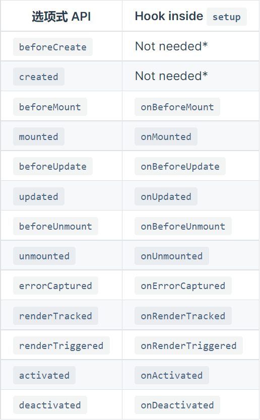

### 组合式API的由来？
在vue2项目中，我们会将同一段逻辑的代码放到不同的地方，当我们的组件开始变得更大时，逻辑关注点的列表也会增长，这种写法会造成阅读代码的不便利。

比如现在有一个仓库列表，包含搜索和筛选功能，那么实现组件的代码大概如下
```js
export default {
    props: {
        user: { 
            type: String,
            required: true
        }
    },
    data() {
        return {
            repositories: [],
            filters: { ... },
            searchQuery: ''
        }
    },
    computed: {
        filteredRepositories () { ... }, // 仓库的过滤方法
        repositoriesMatchingSearchQuery () { ... } // 用户表单输入结果的处理方法
    },
    watch: {
        user: 'getUserRepositories'
    },
    methods: {
        getUserRepositories () {
            // 使用 `this.user` 获取用户仓库
        },
    },
    mounted () {
        this.getUserRepositories()
    }
}
```

组件包含的功能
1. 从假定的外部 API 获取该用户的仓库，并在用户有任何更改时进行刷新
2. 使用 searchQuery 字符串搜索仓库
3. 使用 filters 对象筛选仓库

可以看出代码的逻辑是分散的，为了解决这个问题，vue3新增了组合式 API通过这种方法可以把相同逻辑的代码放在一起，便于维护和阅读。

#### setup使用方法介绍

1. 返回一个函数，该函数将作为组件的render函数：
```js
// MyBook.vue

import { h, ref, reactive } from 'vue'

export default {
  setup() {
    const readersNumber = ref(0)
    const book = reactive({ title: 'Vue 3 Guide' })
    // 请注意这里我们需要显式使用 ref 的 value
    return () => h('div', [readersNumber.value, book.title])
  }
}
```
2. 返回一个对象，该对象中包含的数据将暴露给模板使用
```html
<!-- MyBook.vue -->
<template>
  <div>{{ collectionName }}: {{ readersNumber }} {{ book.title }}</div>
</template>

<script>
  import { ref, reactive } from 'vue'

  export default {
    props: {
      collectionName: String
    },
    setup(props) {
      const readersNumber = ref(0)
      const book = reactive({ title: 'Vue 3 Guide' })

      // 暴露给 template
      return {
        readersNumber,
        book
      }
    }
  }
</script>
```

上述的代码使用setup应该如何改写？

```js
export default {
    props: {
        user: { 
            type: String,
            required: true
        }
    },
    data() {
        return {
            repositories: [],
            filters: { ... },
            searchQuery: ''
        }
    },
    computed: {
        filteredRepositories () { ... }, // 仓库的过滤方法
        repositoriesMatchingSearchQuery () { ... } // 用户表单输入结果的处理方法
    },
    watch: {
        user: 'getUserRepositories'
    },
    methods: {
        getUserRepositories () {
            // 使用 `this.user` 获取用户仓库
        },
    },
    mounted () {
        this.getUserRepositories()
    }
}
```
setup修改后
```js
import { fetchUserRepositories } from '@/api/repositories'
import { ref, onMounted, watch, toRefs, computed } from 'vue'
export default {
    // props: {
    //     user: { 
    //         type: String,
    //         required: true
    //     }
    // },
    data() {
        return {
            filters: { ... },
            searchQuery: ''
        }
    },
    setup(props) {
      const { user } = toRefs(props)
      let repositories = ref([])
      const getUserRepositories = async () => {
        repositories.value = await fetchUserRepositories(user)
      }
      onMounted(getUserRepositories)
      watch(user, getUserRepositories)
      const filteredRepositories = computed(() => {
        // 仓库的过滤方法
      })
      const repositoriesMatchingSearchQuery = computed(() => {
        // 用户表单输入结果的处理方法
      })
      return {
        repositories,
        getUserRepositories,
        filteredRepositories,
        repositoriesMatchingSearchQuery
      }
    },
}
```

在 setup 内注册生命周期钩子



#### 单文件组件 script setup

script setup 是在单文件组件 (SFC) 中使用组合式 API 的编译时语法糖。相比于普通的 script 语法，它具有更多优势

- 更少的样板内容，更简洁的代码。
- 能够使用纯 TypeScript 声明 props 和抛出事件。
- 更好的运行时性能 (其模板会被编译成与其同一作用域的渲染函数，没有任何的中间代理)。
- 更好的 IDE 类型推断性能 (减少语言服务器从代码中抽离类型的工作)

```js
<script setup>
  console.log('hello script setup')
</script>
```

**注意：普通的script只会在组件首次引入的时候执行一次，script setup会在每次组件实例被创建的时候执行**

