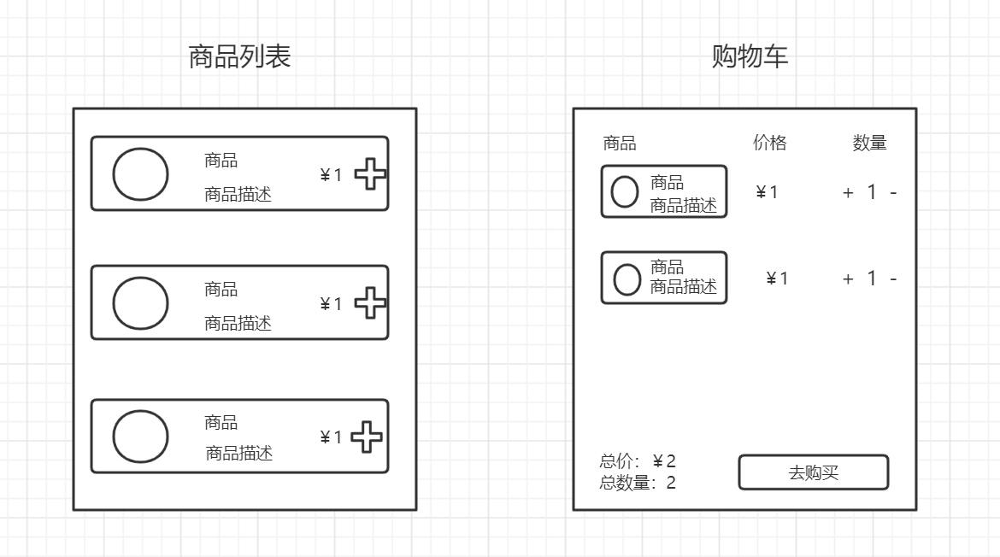

### 什么是Vuex？

Vuex 是一个专为 Vue.js 应用程序开发的状态管理模式 + 库。它采用集中式存储管理应用的所有组件的状态，并以相应的规则保证状态以一种可预测的方式发生变化。

### 什么是“状态管理模式”？
状态，驱动应用的数据源；
视图，以声明方式将状态映射到视图；
操作，响应在视图上的用户输入导致的状态变化。


如果多个视图依赖于同一状态。来自不同视图的行为需要变更同一状态。



### store包含哪些内容
[官方文档](https://vuex.vuejs.org/zh/)
state: 存储状态树的数据，可以用mapState辅助函数获取状态

```js
// 一般的获取state的方法
const Counter = {
  template: `<div>{{ count }}</div>`,
  computed: {
    count () {
      return this.$store.state.count
    }
  }
}

// 在单独构建的版本中辅助函数为 Vuex.mapState
import { mapState } from 'vuex'

export default {
  // ...
  computed: {
        localComputed () { /* ... */ },
        // 使用对象展开运算符将此对象混入到外部对象中
        ...mapState({
            // ...
        })
    }
}
```

getter: 可以认为是 store 的计算属性，当所依赖的state的值发生变化就会重新触发，可以通过辅助函数mapGetters来获取

```js
// store中定义getters
const store = Vuex.createStore({
  state: {
    count: 1
  },
  getters: {
    counts: state => {
      return state.count * 2
    }
  }
})

// 直接引入
computed: {
    counts () {
        return store.getters.counts
    }
}
// 辅助函数引入
computed: {
    ...mapGetters([
      'counts'
      // ...
    ])
}

```

mutation: 用于修改store中的state，mutation中所定义的方法接受两个参数state和提交的数据payload，通过调用store.commit方法和mapMutations辅助函数来实现，**mutation 必须是同步函数**

```js
// 基本用法
store.commit('increment', 参数)

// 使用辅助函数
import { mapMutations } from 'vuex'

export default {
  // ...
  methods: {
    ...mapMutations([
      'increment', // 将 `this.increment()` 映射为 `this.$store.commit('increment')`

      // `mapMutations` 也支持载荷：
      'incrementBy' // 将 `this.incrementBy(amount)` 映射为 `this.$store.commit('incrementBy', amount)`
    ]),
    ...mapMutations({
      add: 'increment' // 将 `this.add()` 映射为 `this.$store.commit('increment')`
    })
  }
}
```

action: **用于处理异步相关的操作**，在内部分发mutation修改state，通过dispath方法和辅助函数mapActions方法来实现
```js
// 基本用法
store.dispatch('increment')

// 使用辅助函数
import { mapActions } from 'vuex'

export default {
  // ...
  methods: {
    ...mapActions([
      'increment', // 将 `this.increment()` 映射为 `this.$store.dispatch('increment')`

      // `mapActions` 也支持载荷：
      'incrementBy' // 将 `this.incrementBy(amount)` 映射为 `this.$store.dispatch('incrementBy', amount)`
    ]),
    ...mapActions({
      add: 'increment' // 将 `this.add()` 映射为 `this.$store.dispatch('increment')`
    })
  }
}
```

module: 将状态树拆分成多个模块，每个模块拥有自己的 state、mutation、action、getter
