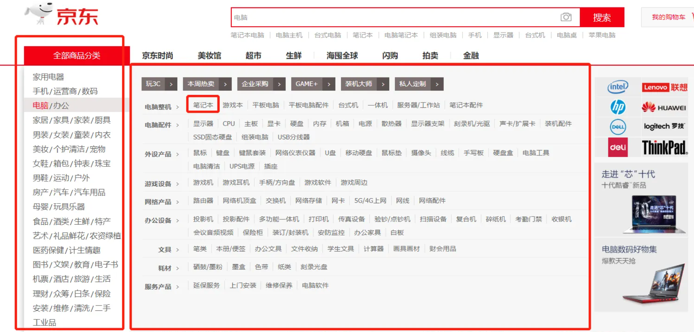

### 列表渲染
将数据按照一种固定的格式进行显示的效果



#### 在 v-for 里使用数组
基本语法
```html
<!-- v-for="(item, index) in array" -->
<!-- item为数组中的每一个元素 -->
<!-- index则为当前元素的索引 -->
<!-- 这里的in可以改写为of -->
<ul>
  <li v-for="item in items" :key="item.id">
    {{ item.message }}
  </li>
</ul>
```
```js
data() {
    return {
        items: [
            {id: 0, message: '西瓜'},
            {id: 1, message: '苹果'},
            {id: 2, message: '香蕉'}
        ]
    }
}
```
key的作用是vue内部虚拟 DOM 在更新过程中辨别新旧节点，在数据顺序发生变化的时候，能够快速找到可以复用的dom节点

思考下，这里添加点击对应项高亮的功能，如何实现？

#### 在 v-for 里使用对象
```html
<!-- v-for="(value, name, index) in object" -->
<ul>
  <li v-for="value in object">
    {{ value }}
  </li>
</ul>
```
```js
data() {
    return {
        object: {
            name: 'allen',
            age: '18',
            sex: '男'
        }
    }
}
```

#### vue对数组操作的方法进行了封装
Vue 将被侦听的数组的变更方法进行了包裹，所以它们也将会触发视图更新。这些被包裹过的方法包括：
- push()
- pop()
- shift()
- unshift()
- splice()
- sort()
- reverse()

**注意：修改数组不能通过下标的方式直接修改**
**对于对象属性的添加需要通过vue.set方法**


#### v-for对于template同样适用
```html
<ul>
  <template v-for="item in items">
    <li>{{ item.msg }}</li>
    <li class="divider" role="presentation"></li>
  </template>
</ul>
```