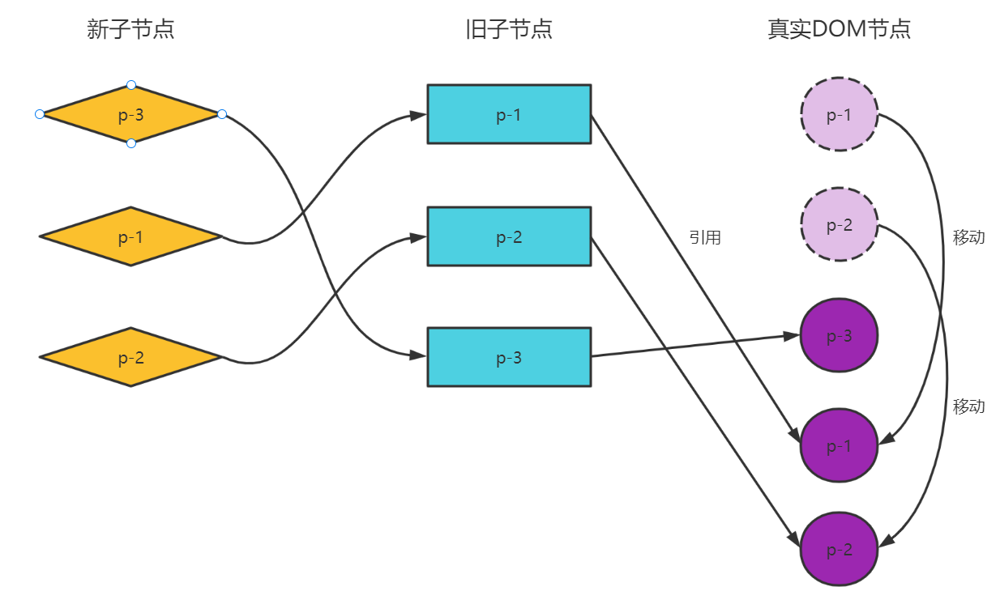
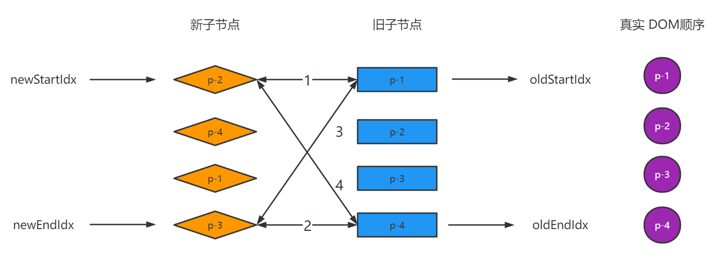

### 双端diff算法

在上述例子中，使用简单diff算法真实 DOM 节点会**移动两次**，但是实际上通过简单的观察可以发现只需要移动一次p-3就可以。


所以得出结论：简单diff算法的性能在某些场景下并不是最好的。对于上述的例子，使用双端diff算法的性能会更高。

#### 双端diff算法比较原理
双端diff是一种对新旧两组子节点的端点进行比较的算法。
```js
// oldChildren
[
    {type: 'p', children: '1'},
    {type: 'p', children: '2'},
    {type: 'p', children: '3'},
    {type: 'p', children: '4'}
]

// newChildren
[
    {type: 'p', children: '4'},
    {type: 'p', children: '2'},
    {type: 'p', children: '1'},
    {type: 'p', children: '3'}
]
```


在双端比较中，每一轮比较都分为四个步骤。

- 第一步：比较旧的一组子节点中的第一个子节点 p-1 与新的一组子节点中的第一个子节点 p-4，看它们是否相同。这里不相同，什么都不做。

- 第二步：比较旧的一组子节点中的最后一个子节点 p-4 与新的一组子节点中的最后一个子节点 p-3，看它们是否相同。这里不相同，什么都不做。

- 第三步：比较旧的一组子节点中的第一个子节点 p-1 与新的一组子节点中的最后一个子节点 p-3，看它们是否相同。这里不相同，什么都不做。

- 第四步：比较旧的一组子节点中的最后一个子节点 p-4 与新的一组子节点中的第一个子节点 p-4。由于它们key相同，所以可以进行 DOM 复用。

思考下，p-4节点所对应的真实 DOM 此时应该如何移动？代码如何实现？


```js
/*
* n1 旧的一组子节点
* n2 新的一组子节点
* container 真实 DOM 的锚点
*/
function patchKeyedChildren(n1, n2, container) {
    const oldChildren = n1.children
    const newChildren = n2.children

    // 端点的索引
    let oldStartIdx = 0
    let oldEndIdx = oldChildren.length - 1
    let newStartIdx = 0
    let newEndIdx = newChildren.length - 1

    // 四个端点索引对应的 vnode 节点
    let oldStartVNode = oldChildren[oldStartIdx]
    let oldEndVNode = oldChildren[oldEndIdx]
    let newStartVNode = newChildren[newStartIdx]
    let newEndVNode = newChildren[newEndIdx]

    // 双端比较
    while (oldStartIdx <= oldEndIdx && newStartIdx <= newEndIdx) {
        if (!oldStartVNode) {
            oldStartVNode = oldChildren[++oldStartIdx]
        } else if (!oldEndVNode) {
            newEndVNode = oldChildren[--oldEndIdx]
        } else if (oldStartVNode.key === newStartVNode.key) {
            // 节点在新的顺序中都处于头部， DOM 不需要移动的
            // 更新索引
            oldStartVNode = oldChildren[++oldStartIdx]
            newStartVNode = newChildren[++newStartIdx]
        } else if (oldEndVNode.key === newEndVNode.key) {
            // 节点在新的顺序中都处于尾部，DOM 不需要移动的
            // 更新索引尾部节点的变量
            oldEndVNode = oldChildren[--oldEndIdx]
            newEndVNode = newChildren[--newEndIdx]

        } else if (oldStartVNode.key === newEndVNode.key) {
            // 移动 DOM 操作
            // oldStartVNode.el 移动到 oldEndVNode.el.nextSibling
            insert(oldStartVNode.el, container, oldEndVNode.el.nextSibling)
            // DOM 移动完成后，更新索引值，然后指向下一个位置
            oldStartVNode = oldChildren[++oldStartIdx]
            newEndVNode = newChildren[--newEndIdx]
        } else if (oldEndVNode.key === newStartVNode.key) {
            // 移动 DOM 操作
            // oldEndVNode.el 移动到 oldStartVNode.el 前面
            insert(oldEndVNode.el, container, oldStartVNode.el)
            oldEndVNode = oldChildren[--oldEndIdx]
            newStartVNode = newChildren[++newStartIdx]
        } else {
            // 遍历旧的一组子节点，找到newStartVNode拥有相同key的元素
            const idxInOld = oldChildren.findIndex(node => node.key === newStartVNode.key)
            // idxInOld 大于 0，说明找到了可复用的节点，并且需要将对应的真实 DOM 移动到头部
            if (idxInOld > 0) {
                // idxInOld 对应旧子节点中需要移动的节点
                const vnodeToMove = oldChildren[idxInOld]
                // 将 vnodeToMove.el 移动到头部节点 oldStartVNode 前面
                insert(vnodeToMove.el, container, oldStartVNode.el)
                // idxInOld 处的节点对应的真实 DOM 已经处理过，这里设置为undefined
                oldChildren[idxInOld] = undefined
                // 更新新子节点头部节点的指针
                newStartVNode = newChildren[++newStartIdx]
            }
        }
    }
}
```

#### 非理想状况的处理方式
在进行双端比较中，可能会出现第一轮比较时，无法找到可以复用的节点。

在这种情况下，需要尝试非头部，尾部的节点能否复用。可以用新的一组子节点去旧的一组子节点去寻找。

这里拿新的一组子节点的头部节点p-2去旧的一组子节点中查找时，会在索引为1的位置找到可复用的节点。说明p-2旧子节点对应的真实 DOM 需要移动到旧子节点 p-1 所对应的真实 DOM 之前。

已经处理过的旧子节点后续不用继续比较，这里设置为undefined。然后开始进行双端比较。在这一轮的比较第四步，找到了可复用的节点。所以将真实 DOM 中的p-4移动到p-1的前面，并且更新对应指针。

在这一轮比较的第一步就找到了可复用的节点，不需要移动 DOM 节点，并更新指针。

在这一轮比较中发现旧子节点中头部节点为undefined。不用比较，直接跳过。

继续进行比较，发现第一轮比较就可以找到复用节点。不需要移动 DOM，更新指针。这时满足循环停止条件，双端比较结束。

思考下，以上内容转变为代码将如何编写？