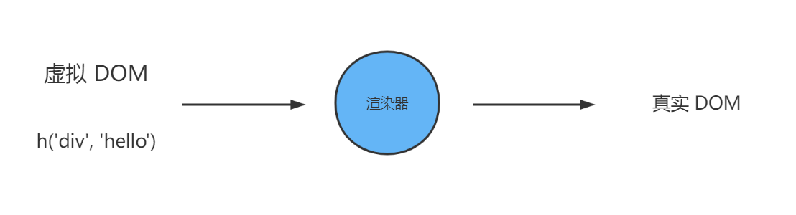

#### 声明式描述UI
声明式框架编写前端页面涉及的内容
1. DOM元素：例如是div标签还是a标签
2. 属性：如 a 标签的href属性，再加上id class等属性
3. 事件：如 click change
4. 元素的层级结构：DOM树的层级结构，既有子节点，又有父节点

通过框架来实现的方法
1. 使用与HTML一致的方法来描述DOM元素，比如div标签可以使用&#60;div&#62;&#60;/div&#62;
2. 使用与HTML一致的方法来描述属性，例如&#60;div id="app"&#62;&#60;/div&#62;
3. 使用：或v-bind来描述动态绑定的属性，例如&#60;div id="dynamicId"&#62;&#60;/div&#62;
4. 使用@或v-on来描述事件，例如点击事件&#60;div @click="handler"&#62;&#60;/div&#62;
5. 使用与HTML一致的方法来描述层级结构，例如一个具有 span 子节点的div标签&#60;div&#62;&#60;span&#62;&#60;/span&#62;&#60;/div&#62;

除了可以使用**模板**声明式的描述ui，还可以使用**javascript对象**来进行描述

```js
const title = {
    // 标签名称
    tag: 'h1',
    // 标签属性
    props: {
        onClick: handler
    },
    // 子节点
    children: [
        { tag: 'span' }
    ]
}
```

javascript对象和描述UI的区别在于js对象描述UI更加灵活。比如我们要表示一个标题，根据标题级别不同，会分别渲染h1-h6这几个标签，思考下应该如何来写？


<details>
<summary>HTML来描述UI</summary>
<pre>
<code>
&#60;h1 v-if="level === 1"&#62;&#60;/h1&#62;
&#60;h2 v-else-if="level === 2"&#62;&#60;/h2&#62;
&#60;h3 v-else-if="level === 3"&#62;&#60;/h3&#62;
&#60;h4 v-else-if="level === 4"&#62;&#60;/h4&#62;
&#60;h5 v-else-if="level === 5"&#62;&#60;/h5&#62;
&#60;h6 v-else-if="level === 5"&#62;&#60;/h6&#62;
</code>
</pre>
</details>
<details>
<summary>javascript对象来描述</summary>
<pre>
<code>
let level = 3
const title = {
    tag: `h${level}`
}
</code>
</pre>
</details>
<br/>
可以发现，使用js对象来描述UI更加的灵活。“这种对象”在vue框架中被称为**虚拟DOM**，渲染函数内部可以创建虚拟DOM，然后vue.js可以将其内容进行渲染。

#### 渲染器的介绍
渲染器的作用就是把虚拟DOM渲染为真实DOM


思考下，我们有一个虚拟 DOM，如何将它转换为真实 DOM
```js
const vnode = {
    tag: 'div',
    props: {
        onClick: () => alert('hello')
    },
    children: 'click me'
}
```

实现渲染函数renderer

```js
/**
 * @vnode 虚拟 DOM 对象
 * @container 一个真实 DOM 元素，作为挂载点，渲染器会把虚拟 DOM 渲染到该挂载点
 */
function renderer(vnode, container) {
    // 使用vnode.tag作为创建的dom标签
    const el = document.createElement(vnode.tag)
    // 遍历vnode.props，将属性 事件添加到DOM上
    for (const key in vnode.props) {
        // 如果是事件
        if (/^on/.test(key)) {
            el.addEventListener(
                // 事件名称 onClick 转为 click
                key.substr(2).toLowerCase(),
                vnode.props[key] // 处理函数
            )
        }
    }

    // 处理 children
    if (typeof vnode.children === 'string') {
        // 如果 children 是字符串，说明它是元素的文本子节点
        el.appendChild(document.createTextNode(vnode.children))
    } else if (Array.isArray(vnode.children)) {
        // 递归的方式调用 renderer 函数渲染子节点，挂载在 el 元素下
        vnode.children.forEach(child => renderer(child, el))
    }

    // 将元素添加到挂载节点下
    container.appendChild(el)
}
```