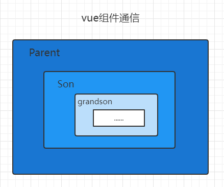
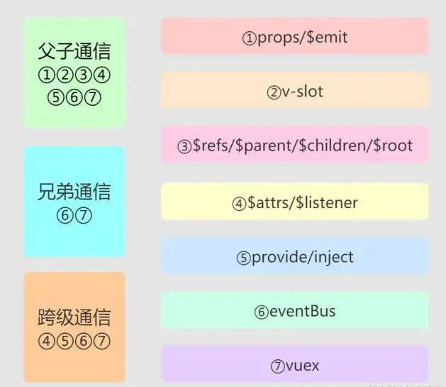

### Vue组件通信的方式

1. props/$emit 可以实现父子组件的双向通信，父组件通过props的方式向子组件传递数据，而通过$emit 子组件可以向父组件通信。

2. v-slot：可以实现父子组件单向通信（父向子传值），在实现可复用组件，向组件中传入DOM节点、html等内容以及某些组件库的表格值二次处理等情况时，可以优先考虑v-slot。

3. $children/$parent/$refs/$root 父组件通过this.$children的方式获取组件列表，但是$children获取的列表并不保证顺序，也不是响应式的。子组件可以通过$parent获取到父组件的实例。

4. $attrs/$listeners：能够实现跨级双向通信，能够让你简单的获取传入的属性和绑定的监听，并且方便地向下级子组件传递，在构建高级组件时十分好用。

5. provide/inject 父组件中通过provide来提供变量，子组件及子代组件通过inject来注入变量。provide/inject API主要是解决了跨级组件间的通信问题，不过它的使用场景，主要是子组件获取上级组件的状态。

6. EventBus 可以实现全局通信，在项目规模不大的情况下，可以利用eventBus实现全局的事件监听。但是eventBus要慎用，避免全局污染和内存泄漏等情况。

7. Vuex：可以实现全局通信，是vue项目全局状态管理的最佳实践。在项目比较庞大，想要集中式管理全局组件状态时，那么安装Vuex准没错！

