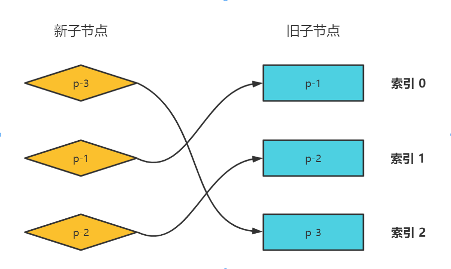

### Diff算法介绍
在vue中用于比较新旧vnode的子节点都是一组节点时，为了以最小的性能开销完成更新，需要比较两个子节点，用与比较的算法就叫作diff算法。

#### 简单diff算法
看一个例子，通过这组虚拟节点进行更新的步骤
```js
const oldVNode = {
    type: 'div',
    children: [
        { type: 'p', children: '1' },
        { type: 'p', children: '2' },
        { type: 'p', children: '3' }
    ]
}
const newVNode = {
    type: 'div',
    children: [
        { type: 'p', children: '4' },
        { type: 'p', children: '5' },
        { type: 'p', children: '6' }
    ]
}
```
<details>
<summary>代码实现</summary>
<pre>
<code>
function patchChildren(n1, n2) {
    if (typeof n2.chilren === 'string') {
        // 省略部分代码
    } else if (Array.isArray(n2.children)) {
        // 更新逻辑
        const oldChildren = n1.children
        const newChildren = n2.children
        for (let i = 0; i < newChildren.length; i++) {
            // 更新子节点
            patch(oldChildren[i], newChildren[i])
        }
    } else {
        // 省略部分代码
    }
}
</code>
</pre>
</details>

#### 如果节点的个数对不上怎么解决？

```js
function patchChildren(n1, n2) {
    if (typeof n2.chilren === 'string') {
        // 省略部分代码
    } else if (Array.isArray(n2.children)) {
        // 更新逻辑
        const oldChildren = n1.children
        const newChildren = n2.children
        // 旧节点的长度
        const oldlen = oldChildren.length
        // 新节点的长度
        const newlen = newChildren.length

        const commonLength = Math.min(oldlen, newlen)

        for (let i = 0; i < commonLength; i++) {
            // 更新节点
            patch(oldChildren[i], newChildren[i])
        }
        // newlen > oldlen, 需要挂载
        if (newlen > oldlen) {
            for (let i = commonLength; i < newlen; i++) {
                patch(null, newChildren[i])
            }
        } else if (oldlen > newlen) {
            // oldlen > newlen, 需要卸载
            for (let i = commonLength; i < oldlen; i++) {
                unmount(null, newChildren[i])
            }
        }
    } else {
        // 省略部分代码
    }
}
```

#### 如果虚拟节点的顺序发生变化怎么解决？
```js
// type不同的虚拟节点
// oldVNode
[
    { type: 'p' },
    { type: 'div' },
    { type: 'span' },
]
// newChildren
[
    { type: 'span' },
    { type: 'p' },
    { type: 'div' },
]
// type相同数据不同的虚拟节点
// oldVNode
[
    { type: 'p', children: '1' },
    { type: 'p', children: '2' },
    { type: 'p', children: '3' }
]
// newChildren
[
    { type: 'p', children: '3' },
    { type: 'p', children: '2' },
    { type: 'p', children: '1' }
]
```


#### 思路分析
第一步：取新的一组子节点中的第一个节点p-3，它的key为3。尝试在旧的一组子节点中找到具有相同key值的可复用节点，如果能找到，记录旧子节点中当前节点的索引为2

第二步：取新的一组子节点中的第二个节点p-1，它的key为1。尝试在旧的一组子节点中找到具有相同key值的可复用节点，如果能找到，记录旧子节点中当前节点的索引为0

此时索引值的递增顺序被打破。节点p-1在旧children中的索引是0，它小于节点p-3在旧children中的索引2。**说明p-1在旧children中排在节点p-3前面，但在新的children中，他排在节点p-3后面。** 所以，我们得到结论：**节点p-1对应的真实DOM需要移动**。

第三步：取新的一组子节点中的第二个节点p-2，它的key为2。尝试在旧的一组子节点中找到具有相同key值的可复用节点，如果能找到，记录旧子节点中当前节点的索引为1

同理，**节点p-2在旧children中排在节点p-3前面，但在新的children中，它排在节点p-3后面。因此，节点p-2对应的真实DOM也需要移动**

此时索引值的递增顺序被打破。节点p-1在旧children中的索引是0，它小于节点p-3在旧children中的索引2。**说明p-1在旧children中排在节点p-3前面，但在新的children中，他排在节点p-3后面。** 所以，我们得到结论：**节点p-1对应的真实DOM需要移动**。

```js
function patchChildren(n1, n2) {
    if (typeof n2.chilren === 'string') {
        // 省略部分代码
    } else if (Array.isArray(n2.children)) {
        // 更新逻辑
        const oldChildren = n1.children
        const newChildren = n2.children
        
        // 用来存储寻找过程中最大的索引值
        let lastIndex = 0
        for (let i = 0; i < newChildren.length; i++) {
            const newVNode = newChildren[i]
            for (let j = 0; j < oldChildren.length; j++) {
                const oldVNode = oldChildren[i]
                if (newVNode.key === oldVNode.key) {
                    patch(oldVNode, newVNode)
                    if (j < lastIndex) {
                        // 如果当前找到的节点在旧Children中的索引小于lastIndex
                        // 说明我们的当前节点对应的真实dom是需要移动的
                    } else {
                        lastIndex = j
                    }
                }
                break;
            }
        }
    } else {
        // 省略部分代码
    }
}
```

#### 如何移动元素？


#### 思路分析
第一步：首先将旧子节点上的真实dom赋值给对应新节点的dom

第二步：找到需要移动的虚拟节点，将它上一个虚拟节点对应的真实DOM的下一个兄弟节点作为锚点

第三步：将当前虚拟节点对应的真实dom移动到锚点位置

```js
function patchChildren(n1, n2) {
    if (typeof n2.chilren === 'string') {
        // 省略部分代码
    } else if (Array.isArray(n2.children)) {
        // 更新逻辑
        const oldChildren = n1.children
        const newChildren = n2.children
        
        // 用来存储寻找过程中最大的索引值
        let lastIndex = 0
        for (let i = 0; i < newChildren.length; i++) {
            const newVNode = newChildren[i]
            for (let j = 0; j < oldChildren.length; j++) {
                const oldVNode = oldChildren[i]
                if (newVNode.key === oldVNode.key) {
                    patch(oldVNode, newVNode)
                    if (j < lastIndex) {
                        // 如果当前找到的节点在旧Children中的索引小于lastIndex
                        // 说明我们的当前节点对应的真实dom是需要移动的

                        // 先获取当前newVNode的上一个节点
                        const prevVNode = newChildren[i - 1]
                        if (prevVNode) {
                            // 如果prevVNode不存在，说明prevVNode就是第一个，不需要移动
                            const anchor = prevVNode.el.nextSibling
                            insert(newVNode.el, anchor)
                        }
                    } else {
                        lastIndex = j
                    }
                }
                break;
            }
        }
    } else {
        // 省略部分代码
    }
}
```